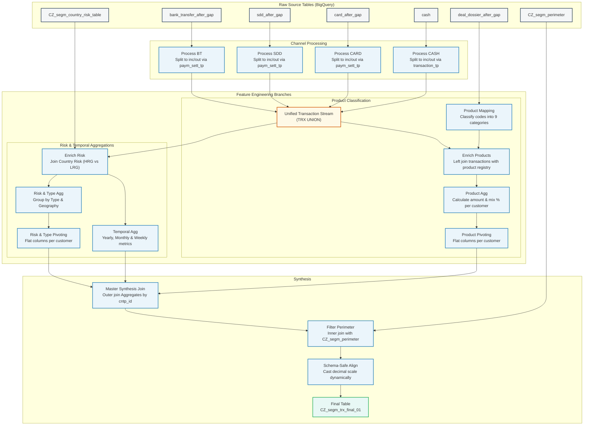

# The Compliance Chronicles: Building the 360° Customer Risk Shield
## Trainee Companion Guide for Notebook `02_Data_Prep_transaction_BigQuery.ipynb`

Welcome, Compliance Data Engineer! 

Today, you are joining the **Financial Intelligence and AML (Anti-Money Laundering) Analytics Team** at **UniCredit Czech Republic (CZ)**. Your primary mission is to protect the bank and its customers from financial crimes, including money laundering, terrorist financing, and international sanctions violations.

This guide is designed to accompany you through the execution of your second main pipeline: `02_Data_Prep_transaction_BigQuery.ipynb`. Rather than just seeing lines of code, you will discover the **underlying stories, banking concepts, and critical system designs** that turn raw, chaotic transaction logs into a clean, structured compliance shield.

---

## 🧭 The Mission: The 360-Degree Behavioral Profile

In a large bank like UniCredit, millions of transactions occur daily. Compliance officers cannot analyze every single transfer or card payment manually. Instead, modern compliance rely on **behavioral risk scoring models**. These models need a single, flat, structured table containing a complete behavioral signature for every customer.

Your objective in this lab is to build this signature—a table named `CZ_segm_trx_final_01` in BigQuery—using **PySpark running on Serverless Dataproc**. This unified dataset will aggregate transactions across **four different payment channels**, enrich them with **geographic risk metadata**, classify them by **financial product profiles**, and isolate the results to our **active regulatory perimeter**.

> [!IMPORTANT]
> **Why Serverless Spark?**  
> In the past, running this pipeline required spinning up huge, expensive Hadoop/Spark clusters that stayed idle overnight, costing the bank thousands of Euros in wasted resources. By transitioning to **Serverless Dataproc** and **BigQuery Studio**, we spin up computing nodes on-demand in seconds, process our data, write the results back to BigQuery, and automatically teardown the executors—saving costs and reducing operational complexity.

---

## 🗺️ The Architecture: End-to-End Data Flow

Here is how your data travels from the raw systems to the final polished compliance ledger:



---

## 📖 Chapter Walkthrough: Behind the PySpark Code

Let’s step through the notebook sections as chapters in our compliance operation.

### Chapter 1: Establishing the Command Center (Spark Session)
Before writing any code, we must initialize PySpark. In standard Spark environments, loading custom connectors can cause conflicting classloader errors. 

Your notebook sets up an **Environment-Aware Spark Session** utilizing the modern Scala-independent Maven package for the BigQuery connector (`spark-3.5-bigquery:0.44.2`). This enables Spark to stream data directly out of BigQuery into Dataproc memory in high-performance Google Arrow format, bypassing slow, old-school JDBC drivers.

```python
spark = (SparkSession.builder
    .appName('UniCredit CZ Compliance Training')
    .config('spark.jars.packages', 'com.google.cloud.spark:spark-3.5-bigquery:0.44.2')
    .getOrCreate())
```

---

### Chapter 2: Establishing Risk Parameters and the Gatekeeper
Every compliance investigation requires a **reference framework** and a **scope**.
1. **The Compass (Country Risk Table):** This table contains a global database mapping country ISO codes to their compliance risk categories. Is it an offshore tax haven? A state sponsor of terrorism? An active target of EU sanctions? This reference enables us to tag customer behavior as High Risk Geography (`HRG`) or Low Risk Geography (`LRG`).
2. **The Gatekeeper (The Perimeter Table):** We only care about transactions belonging to customers who are currently active and subject to Czech Republic (CZ) regulatory compliance. This is our `CZ_segm_perimeter` table. It serves as a master filter.

---

### Chapter 3: Gathering the Rivers (Unifying the 4 Payment Channels)
The bank processes transactions across four distinct systems (channels). Each channel has its own data structure:

| Channel | Source Table | Description |
| :--- | :--- | :--- |
| **BT (Bank Transfers)** | `bank_transfer_after_gap` | High-value domestic and cross-border bank wire transfers. |
| **SDD (SEPA Direct Debits)** | `sdd_after_gap` | Standardized Euro payments, usually used for recurring bills. |
| **CARD (Card Payments)** | `card_after_gap` | POS terminal purchases, e-commerce transactions, and ATM card usage. |
| **CASH (Cash Operations)** | `cash` | Over-the-counter deposits and physical withdrawals at physical branches/ATMs. |

#### The Engineering Challenge: Splitting and Doubling (Directionality)
In banking ledger tables, a transfer is typically logged as **one single record** containing both the debtor (sender) and creditor (receiver). However, to assess customer behavior, we need a **customer-centric view**. 

If Customer A transfers €500 to Customer B:
*   Customer A had an **outgoing (`out`)** transfer.
*   Customer B had an **incoming (`inc`)** transfer.

To handle this, we perform a crucial Spark operation for BT, SDD, and CARD:
1.  **Incoming View (`inc`):** Filter the transactions where our bank is the receiver (`paym_sett_tp` matches `OTH pay BAZ` or `BAZ pay BAZ`). We tag the customer ID as `creditor_cntp_id`, match the transaction country to the sender's country, and mark `direction = 'inc'`.
2.  **Outgoing View (`out`):** Filter the transactions where our bank is the sender (`paym_sett_tp` matches `BAZ pay OTH` or `BAZ pay BAZ`). We tag the customer ID as `debtor_cntp_id`, match the country to the receiver's country, and mark `direction = 'out'`.
3.  **The Union (`bt` / `sdd` / `card`):** We combine (`unionByName`) both views.

> [!TIP]
> **What is BAZ?**  
> `BAZ` is the code representing UniCredit Czech Republic (the internal bank system).  
> *   `OTH pay BAZ` means an **Other** external bank is paying our bank **BAZ** (Incoming to our customer).  
> *   `BAZ pay OTH` means our bank **BAZ** is paying an **Other** external bank (Outgoing from our customer).  
> *   `BAZ pay BAZ` represents an **Internal Transfer** between two UniCredit CZ accounts. By duplicating this transaction into both incoming and outgoing sets, we capture the behavior of both UniCredit customers involved in the transfer!

#### Cash Directionality
Cash is simpler but follows a different logical field:
*   If the transaction type (`transaction_tp`) is `DEPOSIT` -> It's incoming (`inc`) to the customer's account.
*   If the transaction type (`transaction_tp`) is `WITHDRAWAL` -> It's outgoing (`out`) from the customer's account.

#### The Great Union (`trx_union`)
After processing each channel, the pipeline merges all four datasets into a single, massive, consolidated table: `trx_union`. This is the foundational transactional stream containing all events.

---

### Chapter 4: The Alchemist's Crucible (Enrichment, Temporal Analysis, & Pivoting)
Now that we have a consolidated transaction stream, we must extract **intelligence** (feature engineering).

#### 1. Geographic Risk Tagging
We join our unified transaction stream with the `country_risk_table`. If a transaction’s counterparty country matches a high-risk code, it is flagged as `HRG` (High Risk Geography). If it is a standard country, or if the country code is blank (such as local domestic Czech payments), we default it to `LRG` (Low Risk Geography).

#### 2. Metric Compounding & Pivoting
Compliance models cannot read multiple rows per customer. They need a **single row per customer**. Therefore, we aggregate the transactions and **pivot** the columns.

*   **Pivoting by Channel and Direction:** Grouping by customer, channel, and direction (e.g. `incoming_BT`, `outgoing_CASH`) and computing the absolute amount and percentage. This is pivoted to columns like `inc_CASH_amt`, `out_BT_perc`, etc.
*   **Pivoting by Geographic Risk:** Grouping by customer, direction, and risk (e.g. `incoming_HRG`, `outgoing_LRG`). This helps us detect if a customer is suddenly receiving 90% of their money from a sanctioned or high-risk offshore center.
*   **Temporal Aggregations (Velocity Checks):** 
    We calculate transaction volume over different time windows:
    *   **Yearly Totals:** Absolute transaction sum for 2025 (`inc_yearly_amt`, `out_yearly_amt`).
    *   **Monthly Averages:** The average amount moved per month (`inc_monthly_avg`, `out_monthly_avg`).
    *   **Weekly Averages:** The average amount moved per week (`inc_weekly_avg`, `out_weekly_avg`).
    
    *Why?* If a customer's monthly average is normal, but they suddenly move their entire yearly volume in a single week, this temporal velocity spike triggers an AML investigation!

Finally, we outer-join all these pivots together by Customer ID (`cntp_id`) into `trx_type_risk`.

---

### Chapter 5: Unmasking the Products (Behavioral Classification)
An account is not just an account; it is a financial product. Moving €1,000,000 through a savings account is different from moving €1,000,000 through a short-term consumer loan. 

In this chapter, the pipeline reads `deal_dossier_after_gap` (the account registry) and maps numeric banking product registration codes (`deal_reg_tp_cd`) to nine human-readable categories:

```
corporate_loan   ├── Corporate, syndicated, and term loans
mortgage_loan    ├── Mortgage and private mortgage loans
consumer_loan    ├── Consumer and private personal loans
moratorium_loan  ├── Loans with special states / repayment pauses
overdue_loan     ├── Credit exposures / overdue unpaid loans
deposit_account  ├── Term and syndicated deposits
current_account  ├── Core checking / standard transactional accounts
saving_account   ├── Savings, reserve, and escrow-like accounts
other_account    └── Other uncategorized accounts
```

#### The Product Mix Percentages
For every customer, we map their unified transactions to their account products. We then calculate:
1.  The total money moved in each product group (e.g., `inc_current_account_amt`).
2.  The **percentage mix** (e.g., `inc_current_account_perc`).

*Compliance Value:* If a retail customer suddenly has 95% of their incoming money passing through a `corporate_loan` product rather than a typical `current_account`, this is a significant anomaly that warrants screening.

All these metrics are flattened per customer into a pivoted DataFrame called `trx_product`.

---

### Chapter 6: Synthesis and Schema Safeguard (Writing to BigQuery)
Now, we perform the final assembly:
1.  **Master Synthesis:** Join `trx_type_risk` (risk and channel metrics) and `trx_product` (product metrics) on `cntp_id`.
2.  **Perimeter Enforcement:** Inner-join this synthesis with our active `CZ_segm_perimeter` table. This acts as a security filter, immediately discarding any data for test accounts or customers who are out-of-scope for the CZ legal entity compliance boundaries.

#### The "Self-Healing" Schema-Safe Save
When writing large datasets to data warehouses, one of the most common pipeline failures is a **write schema mismatch**. 

PySpark represents high-precision numbers generically (as standard double or generic floating-point decimals). However, BigQuery enforces strict schemas, specifically expecting defined scales (such as `DECIMAL(15, 2)` or `NUMERIC(38, 9)`) to prevent rounding errors in financial ledgers. Attempting to write mismatched scales throws a critical `ProvisionException`.

To handle this, your pipeline implements a dynamic, self-healing metadata check:
```python
target_schema = spark.read.format('bigquery').option('table', dest_table).load().schema
for field in target_schema:
    if field.name in trx_final.columns and isinstance(field.dataType, DecimalType):
        trx_final = trx_final.withColumn(field.name, F.col(field.name).cast(field.dataType))
```
*   **The Logic:** It dynamically reads the schema of the target BigQuery table, finds any columns that are of type `DecimalType` (BigQuery Decimals), and programmatically casts the PySpark DataFrame’s matching columns to match that exact precision and scale before writing!

The pipeline then saves the safe, aligned dataset back to BigQuery under the table name `CZ_segm_trx_final_01` using high-throughput direct writes.

---

## 💡 Key Technical Takeaways for Trainees

Executing this notebook will teach you some of the most critical patterns in modern data engineering:

1.  **Splitting & Unioning Patterns:** Splitting single transactional records into directional (incoming/outgoing) streams to build a comprehensive customer profile.
2.  **Aggregation & Flattening via Pivoting:** Converting high-cardinality transactional event rows into a single wide feature row containing aggregations, enabling direct ingestion into Machine Learning risk models.
3.  **High-Performance BigQuery Connectors:** Utilizing the Spark 3.5 BigQuery package to read/write columns with zero intermediate conversion overhead.
4.  **Data Warehouse Schema Alignment:** Dynamically extracting target schemas at runtime to programmatically enforce data types, preventing standard Spark pipeline crashes.

---

## 📝 Self-Assessment: Test Your Knowledge

Before running the code, read through these reflection questions. Try to answer them as you execute the notebook:

1.  **Question 1:** Why do we join the transaction streams (`bt_crd` and `bt_deb`) using a `unionByName` rather than a standard `union`? What is the technical advantage of `unionByName` in PySpark?
2.  **Question 2:** In Chapter 3, for Bank Transfers, why do we use `F.lpad(F.col('creditor_deal_id'), 16, '0')`? What would happen if we tried to join these IDs with the product dossier table without padding them with leading zeros?
3.  **Question 3:** What is the compliance rationale behind calculating both the absolute amount (e.g. `inc_HRG_amt`) AND the percentage contribution (e.g. `inc_HRG_perc`)? Why is the percentage metric sometimes more useful than the absolute monetary value?
4.  **Question 4:** How does the temporal average (e.g. weekly average vs yearly total) help us identify potential money laundering behavior? Describe a scenario where a customer's yearly total looks normal, but their weekly velocity triggers a red flag.

---

### 🎉 Congratulations!
You now possess the background, context, and operational narrative for this compliance transformation exercise. You are ready to open `02_Data_Prep_transaction_BigQuery.ipynb` in BigQuery Studio and execute the pipeline with a deep understanding of what every Spark executor is doing behind the scenes. 

Go protect the bank! 🏦🛡️
